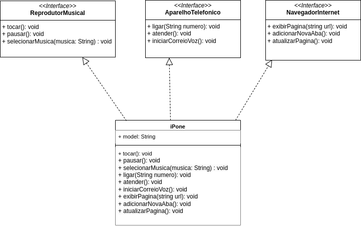

# IPhone

Este é um projeto para treinar habilidades em UML e java, projeto este bem simples por ser de fins didático.

## Diagram UML de um IPhone
> Funcionalidades a modeladas
1- Reprodutor Musical
* **Métodos**: `tocar()`, `pausar()`, `selecionarMusica(String musica)`
  2 -Aparelho Telefônico
* **Métodos:** `ligar(String numero)`, `atender()`, `iniciarCorreioVoz()`
  3 - Navegador na Internet
* **Métodos:** `exibirPagina(String url)`, `adicionarNovaAba()`, `atualizarPagina()`

> Diagrama
> 

> Ao explorar o repositório você encontrará a implementação das classes em Java.
